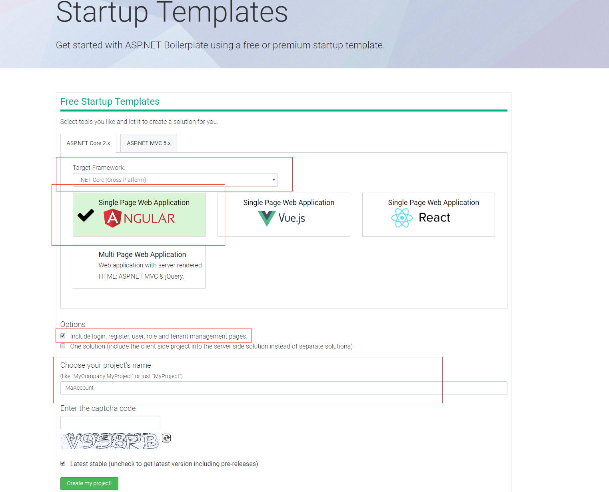

# 索引

## 1.环境准备（Abp 模板使用，服务器准备）

## 2.用户管理 API

## 3. .Netcore 部署到 Docker 并实现环境变量读取配置文件

## 4.添加持续集成 Jenkins

# 环境准备

## 服务器环境

本次实战计划将 NetCore 项目部署到 Linux 服务器，刚好手里有一台阿里云的 1 核 2g 服务器，就用它吧。系统使用 CentOS 7，我们将在上面部署 docker，然后在 docker 中运行我们的项目、mysql、jenkins。

### docker 安装

在 centos7 上安装 docker 网上已经有很多教程了，这里我们安装 docker-ce 版本。

1.安装 docker

```
yum remove docker \
                  docker-client \
                  docker-client-latest \
                  docker-common \
                  docker-latest \
                  docker-latest-logrotate \
                  docker-logrotate \
                  docker-selinux \
                  docker-engine-selinux \
                  docker-engine

 yum install -y yum-utils \
  device-mapper-persistent-data \
  lvm2

  yum-config-manager \
    --add-repo \
    https://download.docker.com/linux/centos/docker-ce.repo

    yum install docker-ce

    systemctl start docker

```

2.docker hub 国内访问的速度特别慢，我们这里使用下阿里云的镜像，可以登录到阿里云->容器镜像服务->镜像加速器。

```
vi /etc/docker/damon.json
{
  "registry-mirrors": ["https://68xvi6g9.mirror.aliyuncs.com"]
}


// 重新启动docker

systemctl start docker
systemctl enable docker
```

### Mysql

安装 mysql

```
docker pull mysql/mysql-server

// 创建mysql的数据文件夹
mkdir -p ~/mysql/data ~/mysql/logs ~/mysql/conf


// my.cnf
 [mysqld]
user=mysql
character-set-server=utf8
default_authentication_plugin=mysql_native_password

[client]
default-character-set=utf8

[mysql]
default-character-set=utf8

cd /mysql

// 启动mysql
docker run -p 3306:3306 --name mysql -v $PWD/conf:/etc/mysql/conf.d -v $PWD/logs:/logs -v $PWD/data:/var/lib/mysql -e MYSQL_ROOT_PASSWORD=123456 -d mysql/mysql-server

//创建用户
docker exec -it mysql bash
mysql -uroot -p
use mysql
CREATE USER 'wb'@'%' IDENTIFIED BY 'pwd123456';
GRANT ALL PRIVILEGES ON *.* TO 'wb'@'%' WITH GRANT OPTION;
alter user 'wb'@'%' identified by 'pwd123456' password expire never;
alter user 'wb'@'%' identified with mysql_native_password by 'pwd123456';
flush privileges;

```

mysql 安装比较麻烦，推荐参考其他 mysql 安装方案。

## Abp 模板下载和使用

访问 ABP 官网：[https://aspnetboilerplate.com/](https://aspnetboilerplate.com/Templates)，我们选择 ASPNET Core 2.x,然后填入项目名称,输入验证码，然后开始下载。



由于我们不需要前端页面，所以删掉 angular 文件夹。

删掉模板自带的 api，即 Application 项目下 Roles,Users,MultiTanancy 文件夹。然后编译通过。

### 切换项目使用 Mysql 数据库。

1.删掉 EntityFrameworkCore 项目中 Microsoft.EntityFrameworkCore.SqlServer 引用包
并安装 Pomelo.EntityFrameworkCore.MySql 包。

2.修改 MaAccountDbContextConfigurer 中，讲 UseSqlServer 修改为 UseMysql。

```
 public static void Configure(DbContextOptionsBuilder<MaAccountDbContext> builder, string connectionString)
        {
            builder.UseMySql(connectionString);
        }

        public static void Configure(DbContextOptionsBuilder<MaAccountDbContext> builder, DbConnection connection)
        {
            builder.UseMySql(connection);
        }

```

3.删除掉 Migrations 文件夹。

4.我们先打开 Web 项目，在 appsetting 中修改连接字符串为我们在上面安装的数据库。

4.打开 nuget 包管理控制台，选择 EntityFrameworkCore 项目。

```
Add-Migration Init
```

使用以下命令生成数据库。

```
Update-Database
```

然后我们的项目就可以运行起来了，按 Ctrl+F5 启动项目，浏览器会自动打开 SwaggerUI 页面。
