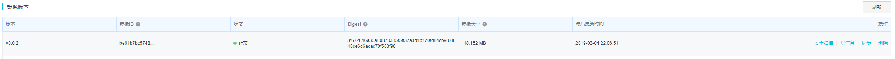

# 索引

## 1.环境准备（Abp 模板使用，服务器准备）

## 2.用户管理 API

## 3. .Netcore 部署到 Docker 并实现环境变量读取配置文件

## 4.添加持续集成 Jenkins

# 安装 windows 版 docker

访问 docker 下载地址：[https://store.docker.com/editions/community/docker-ce-desktop-windows](https://store.docker.com/editions/community/docker-ce-desktop-windows),下载 windows 版 docker，并且一路安装完成。

安装完成后，在右下角点击 docker，选择 settings->Daemon,配置我们第一节中获取到的阿里云镜像加速地址。保存后 docker 自动重启完成。

# 编写项目 dockerfile。

在项目根目录添加一个 dockerfile 文件（没有后缀），编辑以下内容。

```
FROM microsoft/dotnet:2.2-aspnetcore-runtime AS base
WORKDIR /app
EXPOSE 80

FROM microsoft/dotnet:2.2-sdk AS build
WORKDIR /src

COPY ["src/MaAccount.Web.Host/MaAccount.Web.Host.csproj", "src/MaAccount.Web.Host/"]
COPY ["src/MaAccount.Web.Core/MaAccount.Web.Core.csproj", "src/MaAccount.Web.Core/"]
COPY ["src/MaAccount.EntityFrameworkCore/MaAccount.EntityFrameworkCore.csproj", "src/MaAccount.EntityFrameworkCore/"]
COPY ["src/MaAccount.Core/MaAccount.Core.csproj", "src/MaAccount.Core/"]
COPY ["src/MaAccount.Application/MaAccount.Application.csproj", "src/MaAccount.Application/"]
RUN dotnet restore "src/MaAccount.Web.Host/MaAccount.Web.Host.csproj"
COPY . .
WORKDIR "/src/src/MaAccount.Web.Host"
RUN dotnet build "MaAccount.Web.Host.csproj" -c Release -o /app

FROM build AS publish
RUN dotnet publish "MaAccount.Web.Host.csproj" -c Release -o /app

FROM base AS final
WORKDIR /app
COPY --from=publish /app .
ENTRYPOINT ["dotnet", "MaAccount.Web.Host.dll"]

```

2.在 dockerfile 目录下编译镜像。

```
docker build -t maaccount/maaccount:v0.0.2 .
```

3.编译完成后，我们可以通过 `docker images` 查看已编译好的镜像。

# 在本地运行镜像

执行`docker run -d -p 8899:80 --name maaccount maaccount/maaccount:v0.0.2`,

然后访问http://localhost:8899 ,就可以看到我们 docker 里面运行的 aspnetcore 程序了。

如果启动出错，我们也可以通过`docker logs -f maaccount`查看运行日志。

## 指定环境变量

Aspnetcore 中通过环境变量的方式指定了启动时读取哪一个配置文件。所以我们在 docker 运行容器的时候指定，我们当前在本地测试运行，指定环境可以是"Staging"。
删除当前镜像，我们重新指定环境运行。

```
docker stop maaccount
docker rm account
 docker run -d -p 8899:80 -e "ASPNETCORE_ENVIRONMENT=Staging" --name maaccount maaccount/maaccount:v0.0.2

```

注意：我们应该在编译镜像前先在 Host 项目中创建 appsettings.Staging.json，作为本地环境变量使用的配置文件。

# 推送到服务器运行

## 将镜像发布到阿里云

我们在阿里云容器镜像服务中创建我们的仓库，这里指定：maaccount。然后在管理中可以看到推送和拉取镜像的命令。

```
// 通过用户名密码登录到阿里云镜像仓库
docker login --username=yang****yx registry.cn-shenzhen.aliyuncs.com

// 将我们创建的镜像打上阿里云指定的标签,注意这里必须用imageId
docker tag  be61b7bc5748 registry.cn-shenzhen.aliyuncs.com/yang****yx/maaccount:v0.0.2

// 推送到阿里云镜像仓库
docker push registry.cn-shenzhen.aliyuncs.com/yang****yx/maaccount:v0.0.2
```

然后我们可以在阿里云镜像版本中看到刚刚推送的镜像


## 在我们的服务器上拉取镜像

1.根据上面的方式，先登录到阿里云服务器 2.拉取镜像

```
docker pull registry.cn-shenzhen.aliyuncs.com/yang****yx/maaccount:v0.0.2
```

3.指定正式环境运行

```
 docker run -d -p 8899:80 -e "ASPNETCORE_ENVIRONMENT=Production" --name maaccount maaccount/maaccount:v0.0.2
```

注意：记得在阿里云防火墙中打开 8899 端口

4.我们可以在外网访问到 api 了。
