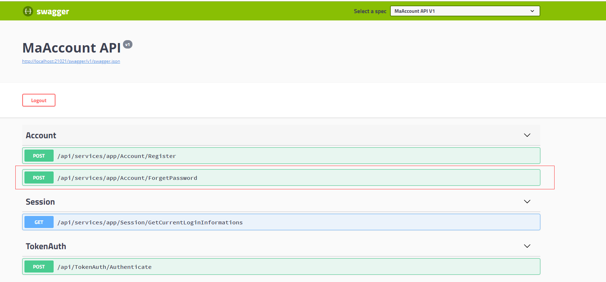

# 索引

## 1.环境准备（Abp 模板使用，服务器准备）

## 2.用户管理 API

## 3. .Netcore 部署到 Docker 并实现环境变量读取配置文件

## 4.添加持续集成 Jenkins

# 用户 API 管理

## 修改注册接口

我们 App 使用安全问题和答案保证找回密码，所以要修改注册接口，在注册时填写安全问题和答案。

1.在 User 实体中添加两个字段：安全问题和答案。

```
 public class User : AbpUser<User>
    {
        ...

        /// <summary>
        /// 密保问题
        /// </summary>
        public string Question { get; set; }

        /// <summary>
        /// 密保答案
        /// </summary>
        public string Answer { get; set; }

        ...
    }

```

2.打开 nuget 包管理器，选择 EntityFrameworkCore 项目，准备迁移数据库。

```
Add-Migration Add_User_PasswordCheck
Update-Database

```

3.修改我们登录接口，在 RegisterInput.cs 中添加安全问题和答案，同时删除邮件，因为我们使用电话号码和密码注册。

```
 public class RegisterInput : IValidatableObject
    {
        [Required]
        [StringLength(AbpUserBase.MaxUserNameLength)]
        [RegularExpression(@"0?(13|14|15|17|18|19)[0-9]{9}", ErrorMessage = "电话号码不正确")]
        public string UserName { get; set; }

        [Required]
        [StringLength(AbpUserBase.MaxPlainPasswordLength)]
        [RegularExpression(@"^(?![a-zA-z]+$)(?!\d+$)(?![!@#$%^&*]+$)[a-zA-Z\d!@#$%^&*]+$", ErrorMessage = "密码必须满足以下规则：最短6位，最长16位\n包含小写大母[a - z]或大写字母[A - Z]\n可以包含数字[0 - 9]\n可以包含下划线[_] 和减号[- ]")]
        [DisableAuditing]
        public string Password { get; set; }

        public string Question { get; set; }

        public string Answer { get; set; }

        public IEnumerable<ValidationResult> Validate(ValidationContext validationContext)
        {
            return new List<ValidationResult>();
        }
    }

```

4.修改 AccountAppService 中的注册方法。

```
// 修改UserRegistrationManager中定义的注册方法
  public async Task<User> RegisterAsync(string name, string surname, string emailAddress, string userName, string plainPassword, bool isEmailConfirmed, string question, string answer)
        {
            CheckForTenant();

            var tenant = await GetActiveTenantAsync();

            var user = new User
            {
                TenantId = tenant.Id,
                Name = name,
                Surname = surname,
                EmailAddress = emailAddress,
                IsActive = true,
                UserName = userName,
                PhoneNumber = userName,
                IsEmailConfirmed = isEmailConfirmed,
                Question = question,
                Answer = answer,
                Roles = new List<UserRole>()
            };

            ...
        }

```

修改 AccountAppService 中传入问题和答案参数

```
   var user = await _userRegistrationManager.RegisterAsync(
                input.UserName,
                input.UserName,
                input.UserName + "@default.com",
                input.UserName,
                input.Password,
                true,// Assumed email address is always confirmed. Change this if you want to implement email confirmation.
                input.Question,
               input.Answer
            );

```

## 添加忘记密码接口

1.在 Account/Dtos 里面添加 ForgetPasswordInput,ForgetPasswordOutput。

```
public class ForgetPasswordInput
    {
        [Required]
        [StringLength(AbpUserBase.MaxUserNameLength)]
        [RegularExpression(@"0?(13|14|15|17|18|19)[0-9]{9}", ErrorMessage = "电话号码不正确")]
        public string UserName { get; set; }

        [Required]
        [StringLength(AbpUserBase.MaxPlainPasswordLength)]
        [RegularExpression(@"^(?![a-zA-z]+$)(?!\d+$)(?![!@#$%^&*]+$)[a-zA-Z\d!@#$%^&*]+$", ErrorMessage = "密码必须满足以下规则：最短6位，最长16位\n包含小写大母[a - z]或大写字母[A - Z]\n可以包含数字[0 - 9]\n可以包含下划线[_] 和减号[- ]")]
        [DisableAuditing]
        public string Password { get; set; }

        public string Question { get; set; }

        public string Answer { get; set; }
    }

      public class ForgetPasswordOutput
    {

    }

```

2.在 IAccountAppSevice 接口中定义忘记密码接口。

```
 /// <summary>
        /// 忘记密码
        /// </summary>
        /// <param name="input"></param>
        /// <returns></returns>
        Task<ForgetPasswordOutput> ForgetPassword(ForgetPasswordInput input);
```

3.在 AccountAppService 中实现忘记密码。

```
   public async Task<ForgetPasswordOutput> ForgetPassword(ForgetPasswordInput input)
        {
            var user = await UserManager.Users.FirstOrDefaultAsync(p => p.UserName == input.UserName);

            if (user == null)
                throw new UserFriendlyException("用户不存在");

            if (user.Question != input.Question || user.Answer != input.Answer)
                throw new UserFriendlyException("密保不正确");

            user.Password = _passwordHasher.HashPassword(user, input.Password);

            await UserManager.UpdateAsync(user);

            var result = await UserManager.SetLockoutEnabledAsync(user, false);

            return new ForgetPasswordOutput();
        }
```

4.重新运行下项目，可以在 swaggerUI 中看到我们新定义的接口。


